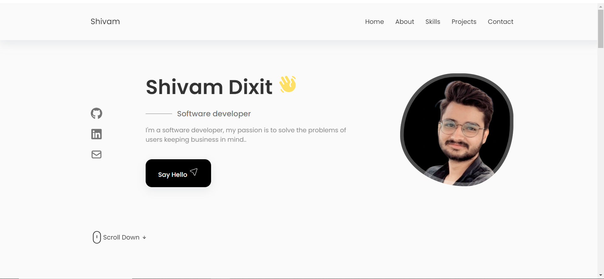

  

<h1 align="center">
  My Portfolio
</h1>

## Introduction

My Portfolio is a React.js application that serves as an online portfolio to showcase my work, skills, and achievements. It provides an overview of my background, displays my projects, and offers a way to contact me.

## Live Demo

[Live website](https://shivamdixit.netlify.app/)

## Features

- About Me: An overview of my background, skills, and experiences.
- Projects: A collection of my notable projects with descriptions, screenshots, and links.
- Skills: A list of my technical skills and proficiencies.
- Resume: A link to download my resume.
- Contact: A form to send me messages or inquiries.

## Homepage:

This website was designed with the tools below:

## Built With

- React
- SASS

## Getting Started

**If you want to know more about how this website was designed, You can run the folowing commands in your terminal if you have git and nodejs already install on your computer**

`git clone https://github.com/shivsd1004/Portfolio.git`

## Available Scripts

## `npm install`

Installs all the dependencies

### `npm start`

Runs the app in the development mode. 
Open [http://localhost:3000](http://localhost:3000) to view it in the browser.

The page will reload if you make edits. 
You will also see any lint errors in the console.

### `npm test`

Launches the test runner in the interactive watch mode. 
See the section about [running tests](https://facebook.github.io/create-react-app/docs/running-tests) for more information.

### `npm run build`

Builds the app for production to the `build` folder. 
It correctly bundles React in production mode and optimizes the build for the best performance.

The build is minified and the filenames include the hashes. 
Your app is ready to be deployed!

See the section about [deployment](https://facebook.github.io/create-react-app/docs/deployment) for more information.

## Show your support

Give a ⭐️ if you like this project!❤️❤️❤️
